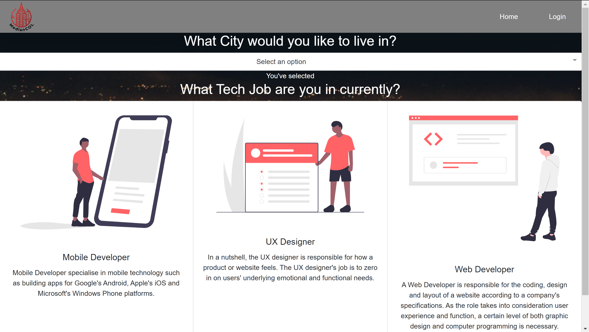

# Median Col

## URL Link

https://livingcity.herokuapp.com

## Description

Welcome to Median Col! 
Median Col is an application that allows the user to compare their city data with data of a city they would be interested in working in.
This is a tech focused application and has the user choose from three jobs.
* Web Developer
* Mobile Developer
* UX Designer

Median Col displays city data from Teleport API so the user can easily compare the two cities. 

This application is a full-stack application utilizing HTML/CSS/Bootstrap/React for the front-end. It follows a MVC design pattern with the use of Node, Express and it uses MongoDB as the database.

## Steps

* The user has the option to login from the top of the page to save their username and password. If they have yet to create an account, it prompts the user to create an account, with an email for a username and 5 digit password. It then greets the user after they have logged in at the top of the page.
* The home page has a dropdown that contains an array of cities across the United States to choose from as their city of residency.  
* After choosing their city, the user is routed to a page to select a new city.
* Below the second dropdown, the user has a choice between three tech jobs. 
* Finally, the user is met with a comparison of the cities previously selected.

## Screenshots

Home Page

Jobs Selection

Results

## Technologies Used

* Node JS
* Javascript
* Heroku
* Bootstrap
* React
* NPM Packages:
    - express
    - react icons
    - react awesome button
    - react spring
    - react dropdown
    - react minimal pie chart
    - axios
    - MongoDB

